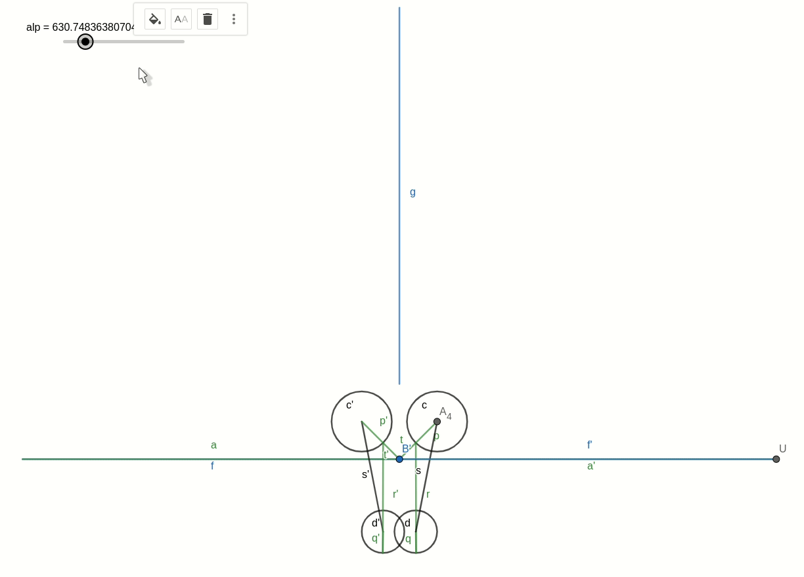
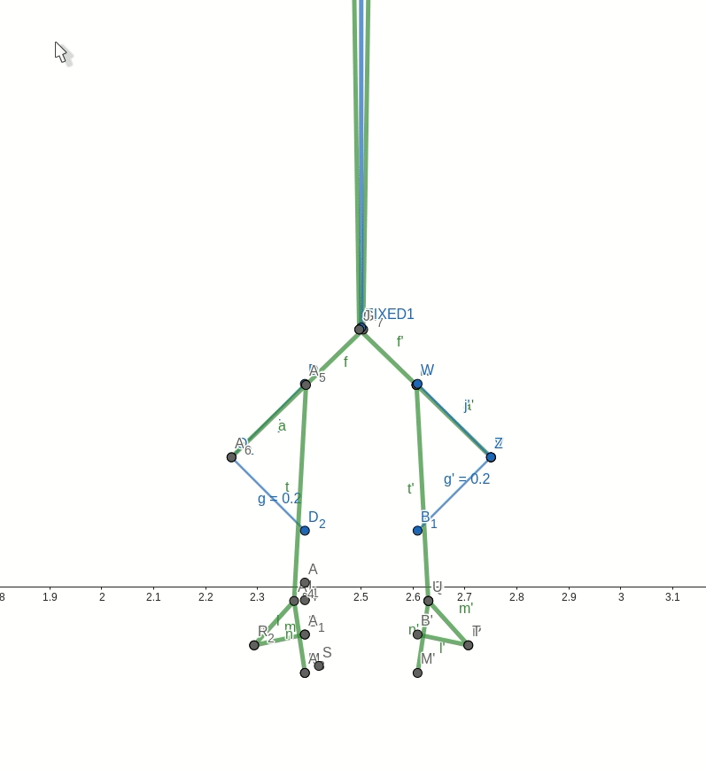
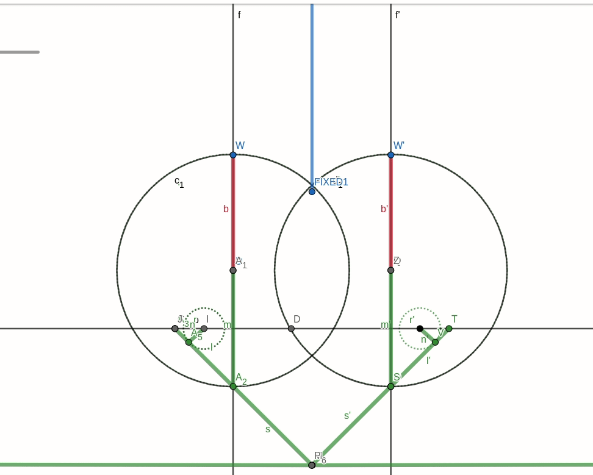

# Assignment 1
by Domrachev Ivan, B20-RO-01

This assignment implements different implementations of flipping mechanism using 4 and 6 bar linkages. Note, that all dimensions are as close to real ones as possible.

## Part 1
> Design a Grashof 4-bar mechanism that shall flip the workpiece to 180 degrees. 

The solution was to create two syncronized crank-rocker mechanisms with special end-effector, each performing 90 degree motion. It's assumed that either the fixation for the lists of metal would be implemented, or the magnets would prevent the metal from falling. After that, another mechanisms carefully catches it and finalizes the rotation. 

Note that the mechanisms could be plased on any distance from each other to adjust the width of materials etc. The end effector (here and further on) has length of $2.5m$ to support all sizes of sheets from requirements.

## Part 2 & 3
> Design a 6-bar mechanism to execute the task with continuous motion by the crank link.
> and
> Design a 4-bar or a 6-bar mechanism with a quick return.

Now, the 6-bar mechanism is designed to both perform a continuous motion and implement a quick return. The mechanism is Grashof crank-crank 4-bar mechanism + quickreturn dyad. The time ratio is $T_R \approx 1:2.6$ -- the maximum I managed to get. 

## Part 4
>  Redesign your 6-bar mechanism to use a pneumatic actuator.
>   1. The pneumatic actuator has a travelling length of 160mm.
>   2. The pneumatic cylinder has a retracted length of 325mm. 
To be honest, I didn't understand why the retracted length of the cylinder matters in this scenario. It does not affect the process, so I skipped it. As for travelling lenfth of pneumatic actuator, the A1A2 on the picture has exactly 0.16m shape. 

